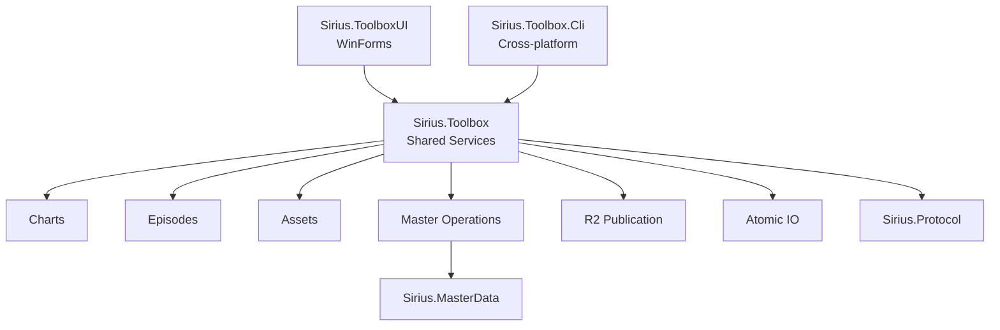

# Sirius Toolbox

<p align="center">
  <strong>面向 World Dai Star / OpenSirius 数据、谱面、剧情、资源与部署流程的统一工具箱。</strong>
</p>

<p align="center">
  WinForms 桌面工具箱 · 跨平台 CLI · MasterMemory · 谱面 · Episode · Scene Index · Cloudflare R2
</p>

<p align="center">
  <a href="./README.md">English</a> ·
  <a href="./README-CN.md"><strong>简体中文</strong></a>
</p>

<p align="center">
  <a href="https://github.com/TeamOpenSirius/SiriusToolbox/actions/workflows/ci.yml"></a>
  
  
  
  
</p>

---

## 项目简介

**Sirius Toolbox** 是 TeamOpenSirius 用于处理 **World Dai Star: Yume no Stellarium（YMST / ユメステ）** 数据与 OpenSirius 基础设施的综合工具箱。

它把容易散落成一次性脚本的工作统一到一个项目里：

- 浏览和修改 `mastermemory.db`；
- 维护活动、交换商店、卡池、乐曲和关联运营期限；
- 使用向导创建自制 MasterData；
- SUS 谱面转换与 Sirius ENC 编解码；
- Episode 打包、解包、检查和编辑；
- 生成 Version 2 `scene-assets.json`；
- 规划并发布 MasterData / CDN 文件到 Cloudflare R2；
- 通过跨平台 CLI 自动化核心工作流。

整体结构：

```text
Sirius.Toolbox
    共享 .NET Service Library
        │
        ├── Sirius.ToolboxUI
        │     Windows WinForms 桌面应用
        │
        └── Sirius.Toolbox.Cli
              跨平台命令行前端
```

Windows 下进行日常可视化维护时，**ToolboxUI 是主要入口**；CI、服务器、自动化脚本以及 Linux/macOS 使用 **Sirius.Toolbox.Cli**。

## WinForms 工具箱

`Sirius.ToolboxUI` 基于 `.NET 10 + WinForms`，当前首页有 **8 个工具入口**：

| 工具 | 用途 |
| --- | --- |
| **主数据编辑器** | MasterMemory 原始表 / Schema 浏览与记录级编辑 |
| **MasterData 运营编辑器** | 可视化维护活动、交换商店、卡池、乐曲与自制内容 |
| **主数据离线重打包** | 类型化 JSON Round-trip 与可控数据库重建 |
| **谱面工具** | SUS 转换和 Sirius ENC 编解码 |
| **剧情工具** | Episode 打包、解包、批处理和 BIN 检查 |
| **剧情资源缓存** | 生成 / 浏览 Version 2 `scene-assets.json` |
| **剧情编辑器** | 编辑 Episode JSON 并导出验证后的 BIN |
| **主数据 / CDN 全量同步** | 预览并发布本地数据 / CDN 文件到 Cloudflare R2 |

打开子工具后首页会隐藏，关闭后返回首页；重复打开同一工具会激活已有窗口。

## 主数据编辑器

Raw MasterData Editor 用于需要完整数据库访问能力的场景，支持 Table 过滤、Schema 查看、分页浏览、Primary Key 查询、JSON 编辑、新增、Duplicate、删除、校验、Save / Save As，以及离线重打包入口。

类型化 MasterMemory 读写由共享的 **`Sirius.MasterData`** Package 提供，不在 UI 项目里重复维护模型。

## MasterData 运营编辑器

运营编辑器在 Raw Table 之上提供“按业务对象”的维护界面，当前有：

- **活动**
- **交换商店**
- **卡池**
- **乐曲**
- **自制内容**

五个页签。

活动和卡池等带有效期的数据通过 Operation Plan 修改：先生成计划、预览变更，再应用到临时 Working Copy，并在接受结果前校验数据库。

**自制内容**页目前提供三个创建向导：

- **卡面**
- **活动**
- **音乐**

向导使用 Schema 驱动字段，并在真正写入前提供 Preview / Validation，避免手动协调多个关联 Table。

典型流程：

```text
原始 mastermemory.db
        ↓
创建并校验 Working Copy
        ↓
生成 Operation Plan
        ↓
预览变更
        ↓
应用关联 Record 修改
        ↓
校验结果
        ↓
Save / Save As
```

## MasterMemory 离线重打包

```text
mastermemory.db
      ↓
导出类型化 JSON
      ↓
修改 Working JSON
      ↓
与 Baseline 比较
      ↓
只重建变化 Table
      ↓
新的 mastermemory.db
```

没有变化的 Table 会尽量保留原始编码 Block，而不是无意义地重新编码。严格字节校验可用于验证 No-op Round-trip。

## 谱面工具

GUI 支持：

- **SUS → Sirius 可读文本**；
- **SUS → Sirius ENC**；
- **Sirius ENC → 文本**；
- Chart Crypto Self Test。

还提供忽略 `WAVEOFFSET`、Strict Mode、Overwrite 和可选中间文本输出。

实现位于 `src/Sirius.Toolbox/Charts/`，包含 SUS Parser、Tempo Map、Conversion 与 Sirius Chart Crypto。

## 剧情工具

支持 JSON → BIN、BIN → JSON、目录批量 Pack / Unpack、BIN Inspection。打包使用 Episode 对应的 MessagePack/LZ4 表示并执行 Round-trip 校验；Inspection 为只读操作。

## 剧情编辑器

Episode Editor 强调“不丢未知数据”：保留 Wrapper Metadata 和未知字段，维持可读 Unicode / 中文 JSON，支持记录增删改，并导出经过校验的 BIN。

## Scene Asset Cache

用于生成 Version 2 `scene-assets.json`，支持独立 Episode JSON / Scene BIN 目录、独立 CDN Prefix、MasterData Version / Source Revision、Metadata-only、SHA-256、中文与嵌套路径、重复 ID 拒绝，以及浏览已有 Index。

## MasterData / CDN / R2 发布

R2 Synchronizer 将已经准备好的本地 MasterData / CDN 文件映射到 Cloudflare R2 的 S3 Compatible Object Layout。

支持：

- 默认 Dry Run；
- Object Mapping 预览；
- Endpoint / Bucket / Key Prefix；
- 自定义目录映射；
- 并发上传与 Retry；
- Cancel / Force；
- Remote Length / SHA-256 比较；
- Local Hash Cache；
- “仅上传本地变更”；
- 设置持久化；
- Windows DPAPI 保护凭据。

自定义映射示例：

```text
scenes-zh-cn=master-data/production/scenes-zh-cn
```

同步器会维护 `r2-hash-cache.json`、`r2-object-map.tsv` 等本地辅助文件。

## 可复用 Asset Service

共享 Library 中还保留 Addressables Catalog Parser、Static Asset / Notation / Episode Scene Discovery、Incremental CDN Mirror，以及发布所需 Hash / Diff State。

当前 ToolboxUI 重点是**本地编辑、运营维护与发布**；旧版独立“官方 MasterData / CDN 下载”窗口已经不属于当前首页产品入口。

# CLI

`Sirius.Toolbox.Cli` 是使用同一 Service Layer 的 `.NET 10` Console Application，适合自动化、CI、Server、Linux 和 macOS。

```bash
dotnet run --project ./src/Sirius.Toolbox.Cli/Sirius.Toolbox.Cli.csproj -- --help
```

### Chart

```bash
sirius-toolbox chart text input.sus output.txt
sirius-toolbox chart text input.sus output.txt --strict
sirius-toolbox chart self-test
```

桌面 GUI 目前还提供额外 ENC Encode/Decode 操作，尚未全部暴露为独立 CLI Command。

### Episode

```bash
sirius-toolbox episode pack episode.json episode.bin
sirius-toolbox episode unpack episode.bin episode.json
sirius-toolbox episode inspect episode.bin
```

### MasterMemory

```bash
sirius-toolbox master verify mastermemory.db
sirius-toolbox master tables mastermemory.db
sirius-toolbox master get mastermemory.db EventMaster 1001
sirius-toolbox master add mastermemory.db EventMaster event.json output.db
sirius-toolbox master update mastermemory.db EventMaster 1001 event.json output.db
sirius-toolbox master delete mastermemory.db EventMaster 1001 output.db
sirius-toolbox master export-text mastermemory.db translations.csv
```

### R2

```bash
sirius-toolbox r2 plan ./output
sirius-toolbox r2 sync ./output
```

连接配置来自：

```text
SIRIUS_R2_ENDPOINT
SIRIUS_R2_BUCKET
R2_ACCESS_KEY_ID
R2_SECRET_ACCESS_KEY
R2_SESSION_TOKEN   （可选）
```

## 架构



`Sirius.Toolbox` 是 `.NET 10` 共享业务库；`Sirius.ToolboxUI` Target 为 `net10.0-windows`；`Sirius.Toolbox.Cli` Target 为 `net10.0`，使用 `System.CommandLine`。

## SiriusData Packages

共享 WDS Model 通过 TeamOpenSirius GitHub Packages 提供：

- `Sirius.Protocol`
- `Sirius.MasterData`

仓库 `nuget.config` 将 `Sirius.*` 映射到：

```text
https://nuget.pkg.github.com/TeamOpenSirius/index.json
```

因此本地源码构建需要拥有 `read:packages` 权限的 GitHub 凭据。GitHub Actions 同样通过仓库 Secret 完成 Package Restore。

## 源码构建

环境：

- .NET 10 SDK；
- TeamOpenSirius GitHub Packages 读取权限；
- WinForms UI 需要 Windows；
- CLI 支持 Windows / Linux / macOS。

```powershell
dotnet restore .\SiriusTools.sln
dotnet build .\SiriusTools.sln -c Release
```

启动 GUI：

```powershell
dotnet run --project .\src\Sirius.ToolboxUI\Sirius.ToolboxUI.csproj
```

直接打开 MasterMemory：

```powershell
dotnet run --project .\src\Sirius.ToolboxUI\Sirius.ToolboxUI.csproj -- .\mastermemory.db
```

CLI：

```powershell
dotnet run --project .\src\Sirius.Toolbox.Cli\Sirius.Toolbox.Cli.csproj -- --help
```

## Release

GitHub Actions 分别发布 **Framework-dependent Single-file** 的 GUI 和 CLI：

| Artifact | Runtime |
| --- | --- |
| Windows UI | `win-x64` |
| CLI | `win-x64` |
| CLI | `linux-x64` |
| CLI | `osx-arm64` |

因此目标机器需要安装匹配的 .NET Runtime。CI 会为各平台生成独立 ZIP，并创建 `build-<run number>` 形式的 GitHub Release。

## 验证与 CI

Release Packaging 前会执行 Restore、Solution Build、Service Regression Harness 和 Repository Security Scan。

测试覆盖 Chart Conversion、Episode Processing、Scene Index、MasterMemory Operations、Addressables Parsing、CDN Mapping / Diff、R2 Planning / Sync 等核心领域。

## 项目结构

```text
SiriusToolbox/
├── src/
│   ├── Sirius.Toolbox/
│   │   ├── Assets/
│   │   ├── Charts/
│   │   ├── Episodes/
│   │   ├── IO/
│   │   ├── Master/
│   │   └── R2/
│   ├── Sirius.ToolboxUI/
│   └── Sirius.Toolbox.Cli/
├── tests/
│   └── Sirius.Toolbox.Tests/
├── docs/
├── scripts/
├── Directory.Build.props
├── Directory.Packages.props
├── nuget.config
└── SiriusTools.sln
```

## TeamOpenSirius 相关项目

- **[SiriusData](https://github.com/TeamOpenSirius/SiriusData)** — 共享协议与 MasterData Model
- **[SiriusServer](https://github.com/TeamOpenSirius/SiriusServer)** — WDS 私有服务端
- **[WDS Editor](https://github.com/TeamOpenSirius/wds-editor)** — 自制谱编辑器
- **[SiriusChartViewer](https://github.com/TeamOpenSirius/SiriusChartViewer)** — Web 谱面预览
- **SiriusNetInject** — SiriusNet 客户端接入与自制谱 Runtime

Sirius Toolbox 的目标是集中承载**离线制作、运营维护、格式转换、数据检查和部署发布工具**，而不是继续把这些能力散落在服务端和客户端仓库中。

## License

Sirius Toolbox 使用 **BSD 2-Clause License**。完整条款见 [`LICENSE`](./LICENSE)。

第三方组件及部分生成 / 游戏来源数据可能具有独立条款，必要时参考 [`THIRD_PARTY_NOTICES.md`](./THIRD_PARTY_NOTICES.md)。

## 声明

Sirius Toolbox 是非官方社区互操作与工具项目。

*World Dai Star*、*World Dai Star: Yume no Stellarium*、ユメステ，以及相关名称、资源、游戏数据和商标均归各自权利人所有。本项目与官方开发商、发行商或运营方不存在隶属或授权关系。
