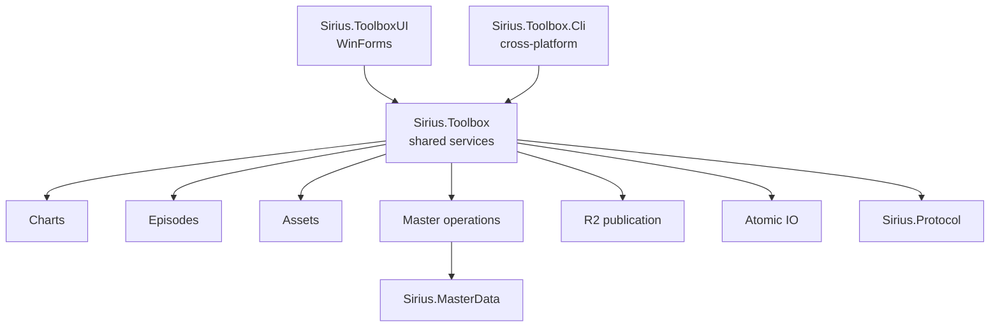

# Sirius Toolbox

<p align="center">
  <strong>The unified utility suite for World Dai Star / OpenSirius data, charts, episodes, assets, and deployment workflows.</strong>
</p>

<p align="center">
  WinForms desktop toolbox · Cross-platform CLI · MasterMemory · Charts · Episodes · Scene indexes · Cloudflare R2
</p>

<p align="center">
  <a href="./README.md"><strong>English</strong></a> ·
  <a href="./README-CN.md">简体中文</a>
</p>

<p align="center">
  <a href="https://github.com/TeamOpenSirius/SiriusToolbox/actions/workflows/ci.yml"></a>
  
  
  
  
</p>

---

## Overview

**Sirius Toolbox** is TeamOpenSirius' general-purpose tool suite for working with **World Dai Star: Yume no Stellarium** data and OpenSirius infrastructure.

It consolidates the offline workflows that otherwise tend to become one-off scripts:

- inspect and edit `mastermemory.db`;
- maintain events, exchange shops, gachas, music, and related operating periods;
- create custom MasterData through guided workflows;
- convert SUS charts and encode/decode Sirius chart payloads;
- pack, unpack, inspect, and edit Episode data;
- generate Version 2 `scene-assets.json` indexes;
- plan and publish MasterData/CDN trees to Cloudflare R2;
- automate the core workflows from a cross-platform CLI.

The codebase has one shared service layer and two front ends:

```text
Sirius.Toolbox
    reusable .NET service library
        │
        ├── Sirius.ToolboxUI
        │     Windows WinForms application
        │
        └── Sirius.Toolbox.Cli
              cross-platform command-line frontend
```

For interactive Windows work, **ToolboxUI is the primary experience**. For CI, servers, scripting, Linux, and macOS, **Sirius.Toolbox.Cli** exposes the same core services without WinForms.

## Desktop Toolbox

`Sirius.ToolboxUI` targets `.NET 10` and WinForms. The current home screen exposes eight tools:

| Tool | Purpose |
| --- | --- |
| **MasterData Editor** | Raw MasterMemory table/schema browsing and record editing |
| **MasterData Operations Editor** | High-level maintenance for events, exchange shops, gachas, music, and custom content |
| **Offline MasterMemory Repack** | Typed JSON round-trip and controlled database rebuild |
| **Chart Tool** | SUS conversion and Sirius ENC encode/decode |
| **Episode Tool** | Episode pack/unpack, batch processing, and inspection |
| **Scene Asset Cache** | Build and inspect Version 2 `scene-assets.json` |
| **Episode Editor** | Edit Episode JSON and export verified BIN payloads |
| **MasterData / CDN / R2 Sync** | Preview and publish prepared local data/assets to Cloudflare R2 |

Opening a child tool hides the start center. Closing it returns to the home screen, and reopening the same tool activates the existing window instead of creating duplicates.

## MasterData Editor

The raw editor provides full database access when a specialized workflow is not appropriate.

It supports table filtering, schema inspection, paged browsing, primary-key lookup, JSON editing, add/duplicate/delete, verification, Save / Save As, and the offline repack workflow.

Typed MasterMemory access is provided by the shared **`Sirius.MasterData`** package rather than duplicated in the UI project.

## MasterData Operations Editor

The operations editor adds a task-oriented layer over raw MasterMemory tables. Current tabs are:

- **Events**
- **Exchange Shops**
- **Gachas**
- **Music**
- **Custom Content**

Timed entities such as events and gachas are edited through operation plans rather than isolated row changes. A plan is previewed, applied to a temporary working database, and verified before it becomes the accepted working copy.

The **Custom Content** page provides guided creation workflows for:

- cards;
- events;
- music.

The form is schema-driven and keeps preview/validation in the workflow so custom additions do not require manually coordinating every related table.

A typical operation is:

```text
Original mastermemory.db
        ↓
Verified working copy
        ↓
Build operation plan
        ↓
Preview changes
        ↓
Apply related record edits
        ↓
Verify result
        ↓
Save / Save As
```

## Offline MasterMemory Repack

The offline repack workflow supports controlled MasterMemory round trips:

```text
mastermemory.db
      ↓
Export typed JSON
      ↓
Edit working JSON
      ↓
Compare against baseline
      ↓
Rebuild changed tables
      ↓
New mastermemory.db
```

Where possible, unchanged tables retain their original encoded blocks instead of being unnecessarily re-encoded. Strict byte verification can be used to validate no-op round trips.

## Chart Tool

The GUI supports:

- **SUS → readable Sirius chart text**;
- **SUS → Sirius ENC**;
- **Sirius ENC → text**;
- chart crypto self-test.

Options include ignoring `WAVEOFFSET`, strict conversion, overwrite control, and optional intermediate text output.

Implementation lives under `src/Sirius.Toolbox/Charts/`, including SUS parsing, tempo mapping, conversion, and Sirius chart crypto.

## Episode Tool

Supported operations:

- JSON → BIN;
- BIN → JSON;
- directory batch pack;
- directory batch unpack;
- BIN inspection.

Packing uses the Episode MessagePack/LZ4 representation and performs round-trip validation. Inspection is read-only.

## Episode Editor

The dedicated editor is designed to preserve data rather than rewrite only the fields the UI understands. It keeps wrapper metadata and unknown fields, maintains readable Unicode/Chinese JSON, supports record mutations, and exports verified BIN payloads.

## Scene Asset Cache

The Scene Asset Cache builds **Version 2 `scene-assets.json`** mappings between Episode JSON and scene BIN resources.

It supports independent input directories, independent CDN prefixes for Episode `SourcePath` and scene `RelativePath`, optional version/revision metadata, metadata-only mode, SHA-256 mode, nested/non-ASCII paths, duplicate-ID rejection, and browsing existing indexes.

## MasterData / CDN / R2 Sync

The R2 synchronizer maps prepared local MasterData and CDN files to Cloudflare R2's S3-compatible object layout.

Features include:

- dry-run by default;
- object mapping preview;
- configurable endpoint, bucket, and key prefix;
- custom directory mappings;
- concurrent uploads and retries;
- cancellation and force mode;
- remote length/SHA-256 comparison;
- local hash-cache reuse;
- “only upload local changes” mode;
- persisted settings;
- DPAPI-protected credentials on Windows.

Example custom mapping:

```text
scenes-zh-cn=master-data/production/scenes-zh-cn
```

The synchronizer maintains files such as `r2-hash-cache.json` and `r2-object-map.tsv` so publication plans remain inspectable and unnecessary remote checks can be avoided.

## Reusable Asset Services

The shared library also contains reusable asset-side services for Addressables catalog parsing, static-asset discovery, notation discovery, Episode-scene discovery, incremental CDN mirroring, and publication hash/diff state.

The current desktop product surface focuses on local editing, maintenance, and publication. The older standalone official MasterData/CDN download window is not part of the current home screen.

# CLI

`Sirius.Toolbox.Cli` is a `.NET 10` console application for automation, CI, servers, and non-Windows systems.

Show help:

```bash
dotnet run --project ./src/Sirius.Toolbox.Cli/Sirius.Toolbox.Cli.csproj -- --help
```

### Chart

```bash
sirius-toolbox chart text input.sus output.txt
sirius-toolbox chart text input.sus output.txt --strict
sirius-toolbox chart self-test
```

The desktop GUI currently exposes additional ENC encode/decode operations that are not all dedicated CLI commands.

### Episode

```bash
sirius-toolbox episode pack episode.json episode.bin
sirius-toolbox episode unpack episode.bin episode.json
sirius-toolbox episode inspect episode.bin
```

### MasterMemory

```bash
sirius-toolbox master verify mastermemory.db
sirius-toolbox master tables mastermemory.db
sirius-toolbox master get mastermemory.db EventMaster 1001
sirius-toolbox master add mastermemory.db EventMaster event.json output.db
sirius-toolbox master update mastermemory.db EventMaster 1001 event.json output.db
sirius-toolbox master delete mastermemory.db EventMaster 1001 output.db
sirius-toolbox master export-text mastermemory.db translations.csv
```

### R2

```bash
sirius-toolbox r2 plan ./output
sirius-toolbox r2 sync ./output
```

R2 commands read configuration from:

```text
SIRIUS_R2_ENDPOINT
SIRIUS_R2_BUCKET
R2_ACCESS_KEY_ID
R2_SECRET_ACCESS_KEY
R2_SESSION_TOKEN   (optional)
```

## Architecture



`Sirius.Toolbox` is the shared `.NET 10` library. `Sirius.ToolboxUI` targets `net10.0-windows`; `Sirius.Toolbox.Cli` targets `net10.0` and uses `System.CommandLine`.

## SiriusData Packages

Shared WDS models are consumed through TeamOpenSirius GitHub Packages:

- `Sirius.Protocol`
- `Sirius.MasterData`

`nuget.config` maps `Sirius.*` to:

```text
https://nuget.pkg.github.com/TeamOpenSirius/index.json
```

Local builds therefore need credentials with `read:packages` access to the TeamOpenSirius feed. GitHub Actions uses repository secrets for package restore.

## Build from Source

Requirements:

- .NET 10 SDK;
- TeamOpenSirius GitHub Packages read access;
- Windows for the WinForms UI;
- Windows, Linux, or macOS for the CLI.

```powershell
dotnet restore .\SiriusTools.sln
dotnet build .\SiriusTools.sln -c Release
```

Run the UI:

```powershell
dotnet run --project .\src\Sirius.ToolboxUI\Sirius.ToolboxUI.csproj
```

Open a MasterMemory database directly:

```powershell
dotnet run --project .\src\Sirius.ToolboxUI\Sirius.ToolboxUI.csproj -- .\mastermemory.db
```

Run the CLI:

```powershell
dotnet run --project .\src\Sirius.Toolbox.Cli\Sirius.Toolbox.Cli.csproj -- --help
```

## Releases

The GitHub Actions pipeline publishes separate **framework-dependent single-file** artifacts:

| Artifact | Runtime |
| --- | --- |
| Windows UI | `win-x64` |
| CLI | `win-x64` |
| CLI | `linux-x64` |
| CLI | `osx-arm64` |

Because releases are framework-dependent, the matching .NET runtime must be available on the target machine. The workflow creates build-tagged GitHub Releases with separate ZIP files for the GUI and each CLI platform.

## Validation and CI

Before release packaging, CI restores packages, builds the solution, runs the service regression harness, and performs a repository security scan.

Coverage includes chart conversion, Episode processing, scene-index generation, MasterMemory operations, Addressables parsing, CDN mapping/diff behavior, and R2 planning/synchronization logic.

## Repository Layout

```text
SiriusToolbox/
├── src/
│   ├── Sirius.Toolbox/
│   │   ├── Assets/
│   │   ├── Charts/
│   │   ├── Episodes/
│   │   ├── IO/
│   │   ├── Master/
│   │   └── R2/
│   ├── Sirius.ToolboxUI/
│   └── Sirius.Toolbox.Cli/
├── tests/
│   └── Sirius.Toolbox.Tests/
├── docs/
├── scripts/
├── Directory.Build.props
├── Directory.Packages.props
├── nuget.config
└── SiriusTools.sln
```

## Related OpenSirius Projects

- **[SiriusData](https://github.com/TeamOpenSirius/SiriusData)** — shared protocol and MasterData models
- **[SiriusServer](https://github.com/TeamOpenSirius/SiriusServer)** — private WDS server implementation
- **[WDS Editor](https://github.com/TeamOpenSirius/wds-editor)** — custom chart editor
- **[SiriusChartViewer](https://github.com/TeamOpenSirius/SiriusChartViewer)** — browser-based chart preview
- **SiriusNetInject** — client-side SiriusNet and custom-chart runtime

Sirius Toolbox is the place for **offline authoring, operational maintenance, conversion, inspection, and deployment tooling** rather than scattering those utilities across server/client repositories.

## License

Sirius Toolbox is licensed under the **BSD 2-Clause License**. See [`LICENSE`](./LICENSE).

Third-party components and game-derived/generated data may have separate terms; see [`THIRD_PARTY_NOTICES.md`](./THIRD_PARTY_NOTICES.md) where applicable.

## Disclaimer

Sirius Toolbox is an unofficial community interoperability and tooling project.

*World Dai Star*, *World Dai Star: Yume no Stellarium*, ユメステ, and related names, assets, game data, and trademarks belong to their respective rights holders. This project is not affiliated with or endorsed by the official developers, publishers, or operators.
